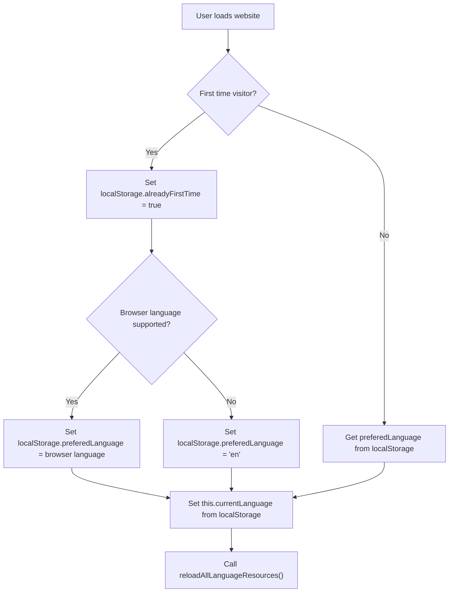
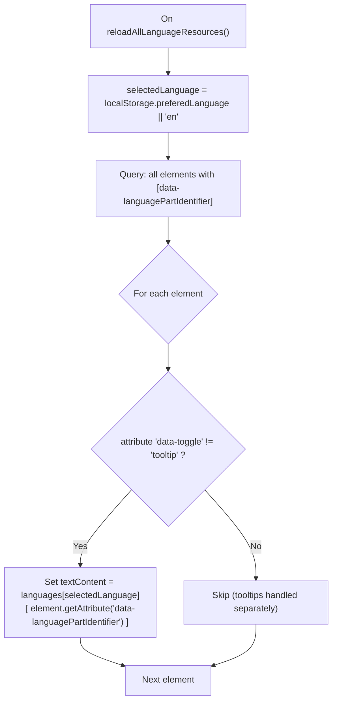
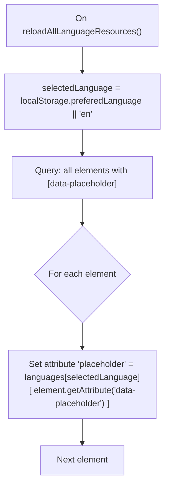
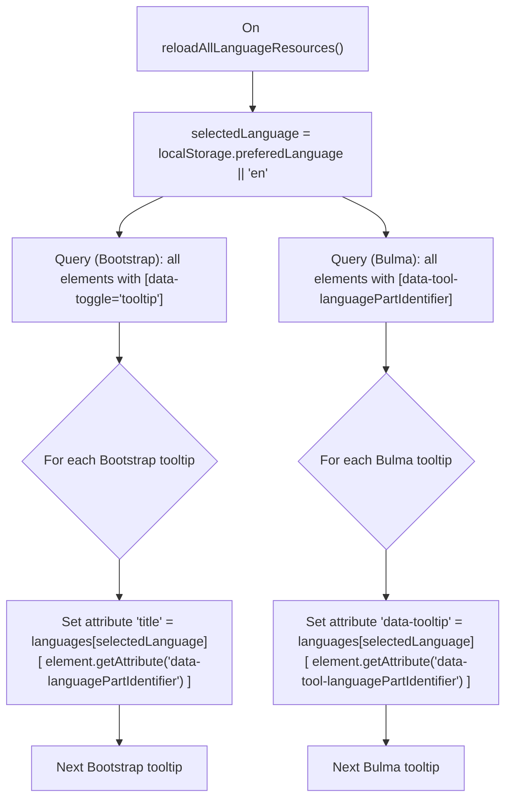
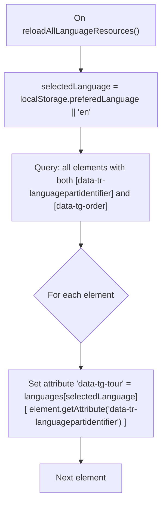

# Technical Overview

### The main core
#### The following gets executed first

### How each component works?
#### ➡️ General elements

#### ➡️ Placeholders

#### ➡️ Tooltips

#### ➡️ TourGuide JS

